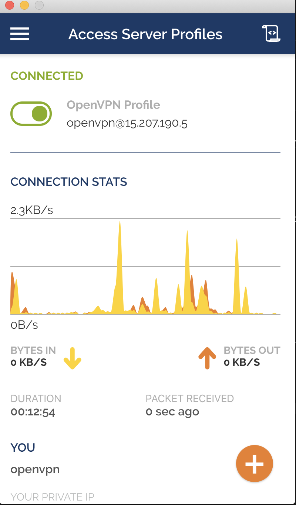
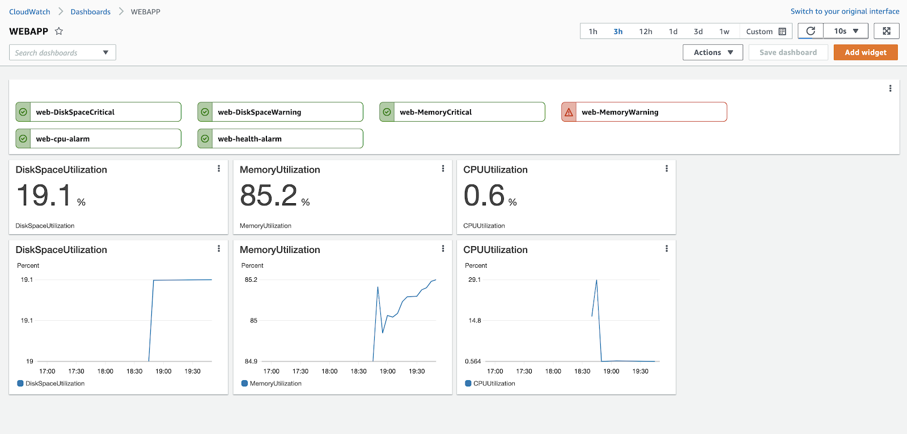

**Rahul Sharma**

**ELTROPY** DEVOPS ASSESSMENT

**18th NOV 2020**

# GOALS

1. Create a VPC

2. Create EC2 instance using Ubuntu Linux

3. Enable and configure Security Group

4. Server Hardening

   1. Research and execute server hardening on this instance

   2. For example (but not limited to the following, implement more if possible)

      1. SSH on a nonstandard port
      2. Disabled Password-based Sign in
      3. Configure UFW (Ubuntu Firewall)
      4. Disable root access

5. VPN - Enable Access only through OpenVPN to this instance

6. CloudWatch - Setup CloudWatch for Disk size and CPU

   1. Enable Email alerts for alerts

7. Enable ClamAV - Free AntiVirus for Linux

8. Backup

   1. Enable backup for instances

# REQUIREMENTS

1. Ansible 2.9.x
2. Terraform 0.13.x
3. AWS Console account with EC2, VPC, Cloudwatch, SNS CRUDs. (default provide should be accessible by aws-cli on ~/.aws/credentials)

**This is a\*\***complete Automated Setup\***\* using Terraform and ansible. We just need to connect with the VPN manually from the system. Everything will be taken care of on its own.**

## Terraform Tasks Brief

### Deploying VPN.

1. Selecting Region from available 14 region

2. Creating VPC for OpenVPN.

   1. Internet Gateway
   2. Public Subnet
   3. Route tables
   4. Security Groups ( Port 1194 open for connecting purposes.)

3. Auto Deploy Provided SSH Key Pairs.

4. Creating Instance for EC2

   1. User-data (For setting some initial VPN setting like username, password)
   2. Static EIP for OpenVPN.

**At this stage, you should connect with OpenVPN as further steps only work with VPN.**

### Connecting VPN

To be able to connect with OpenVPN you need the following:

1. VPN Server IP (You will get it from terraform output once, Deployed.)
2. Username/Password (You will get it from terraform output once, Deployed.)

### Deploying Webapp

Isolated environment (Only Accessible from deployed VPN)

1. Selecting Region from available 14 region

2. Searching Latest Ubuntu LTS from AMI Repo.

3. Creating VPC for OpenVPN.

   1. Internet Gateway.
   2. Private Subnet.
   3. Route tables.
   4. Security Groups ( Port 2224 open for VPN, 80/443 world open.)
   5. Creating Iam Role and policies for Cloudwatch access.

4. Auto Deploy Provided SSH Key Pairs.

5. Creating Instance for EC2

   1. User-data (For setting some initial VPN setting like username, password)
   2. Static EIP for web-app.

### Ansible Configurations.

These configurations will automate triggered from Terraform.

1. #### Configuring Cloudwatch to use an ec2 attached role.

2. #### Firewall

   1. Installing Iptables
   2. Block OS level traffic. (Port 2224 open for VPN, 80/443 world open.)

3. #### Nginx Web Server

   1. Installing Nginx
   2. Setting a Vhost (eltropydemo.rvsharma.com) as well as other settings for root directories, error/access logs.

4. #### OS Level Security(Hardening).

   1. Install software to monitor bad**SSH access** and **Nginx DDOS** (fail2ban)

      1. IP will block for 10 Minutes on 3 Bad SSH attempts.
      2. IP will get blocked for 120 Minutes on 10 error entries in Nginx error logs.

   2. Configure SSH to be more secure (disabling root login, requiring key-based authentication, and allowing a custom SSH port 2224)

   3. Set up automatic updates.

5. #### Securing Nginx (Hardening).

   1. **Nginx_client_body_buffer_size
      Default: 1k
      Description: Sets buffer size for reading client request body. In case the request body is larger than the buffer, the whole body or only its part is written to a temporary file.**
   2. **Nginx_remove_default_site**
      **Default**: true
      **Description**: Disables the default site. Set to false to enable the default site in Nginx.
   3. **Nginx_client_max_body_size**
      **Default**: 1k
      **Description**: Sets the maximum allowed size of the client request body, specified in the “Content-Length” request header field. If the size in a request exceeds the configured value, the 41 3 (Request Entity Too Large) error is returned to the client.
   4. **Nginx_keepalive_timeout**
      **Default**: 5 5
      **Description**: The first parameter sets a timeout during which a keep-alive client connection will stay open on the server-side. The zero value disables keep-alive client connections. The optional second parameter sets a value in the “Keep-Alive: timeout=time” response header field.
   5. **Nginx_server_tokens**
      **Default**: off
      **Description**: Disables emitting the Nginx version in error messages and the "Server" response header field. Set to on to enable the Nginx version in error messages and "Server" response header.
   6. **Nginx_client_header_buffer_size**
      **Default**: 1k
      **Description**: Sets buffer size for reading client request header. For most requests, a buffer of 1K bytes is enough.
   7. **Nginx_large_client_header_buffers**
      Default: 2 1k
      Description: Sets the maximum number and size of buffers used for reading large client request headers.
   8. **Nginx_client_body_timeout**
      **Default**: 10
      **Description**: Defines a timeout for reading client request body.
   9. **Nginx_client_header_timeout**
      **Default**: 10
      **Description**: Defines a timeout for reading the client request header.
   10. **Nginx_send_timeout**
       **Default**: 10
       **Description**: Sets a timeout for transmitting a response to the client.
   11. **Nginx_limit_conn_zone
       Default: $binary_remote_addr zone=default:10m
       Description: Sets parameters for a shared memory zone that will keep states for various keys.**
   12. **Nginx_limit_conn
       Default: default 5
       Description: Sets the shared memory zone and the maximum allowed number of connections for a given key value.**
   13. **Nginx_add_header
       Default: \[ "X-Frame-Options SAMEORIGIN", "X-Content-Type-Options nosniff", "X-XSS-Protection \\"1; mode=block\\"" ]
       Description: Adds the specified field to a response header provided that the response code equals 200, 201, 204, 206, 301, 302, 303, 304, or 307.**
   14. **Nginx_ssl_protocols
       Default: TLSv1.2
       Description: Specifies the SSL protocol which should be used.**
   15. **Nginx_ssl_ciphers
       Default: see defaults.yml
       Description: Specifies the TLS ciphers which should be used.**
   16. **Nginx_ssl_prefer_server_ciphers**
       **Default**: on
       **Description**: Specifies that server ciphers should be preferred over client ciphers when using the TLS protocols. Set to false to disable it.
   17. **Nginx_dh_size**
       **Default**: 2048
       **Description**: Specifies the length of DH parameters for EDH ciphers.

6. #### ClamAV installation and onboot startup.

7. #### AWS Backup Plans

   1. Daily EC2 Backup at noon based on Instance ID.
      

### CloudWatch Monitoring

Automated Deployment of alert policies and centralized Dashboard.

1. #### SNS Topic with Email Subscription.

2. #### Metrics Alarms.

   1. DiskSpaceUtilization >= 70 for 1 datapoints within 2 minutes (Warning)
   2. DiskSpaceUtilization >= 90 for 1 datapoints within 2 minutes (Critical)
   3. MemoryUtilization >= 70 for 1 datapoints within 2 minutes (Warning)
   4. MemoryUtilization >= 90 for 1 datapoints within 2 minutes (Critical)
   5. StatusCheckFailed >= 1 for 1 datapoints within 2 minutes
   6. CPUUtilization >= 80 for 2 datapoints within 4 minutes

3. #### All in one Dashboard.

